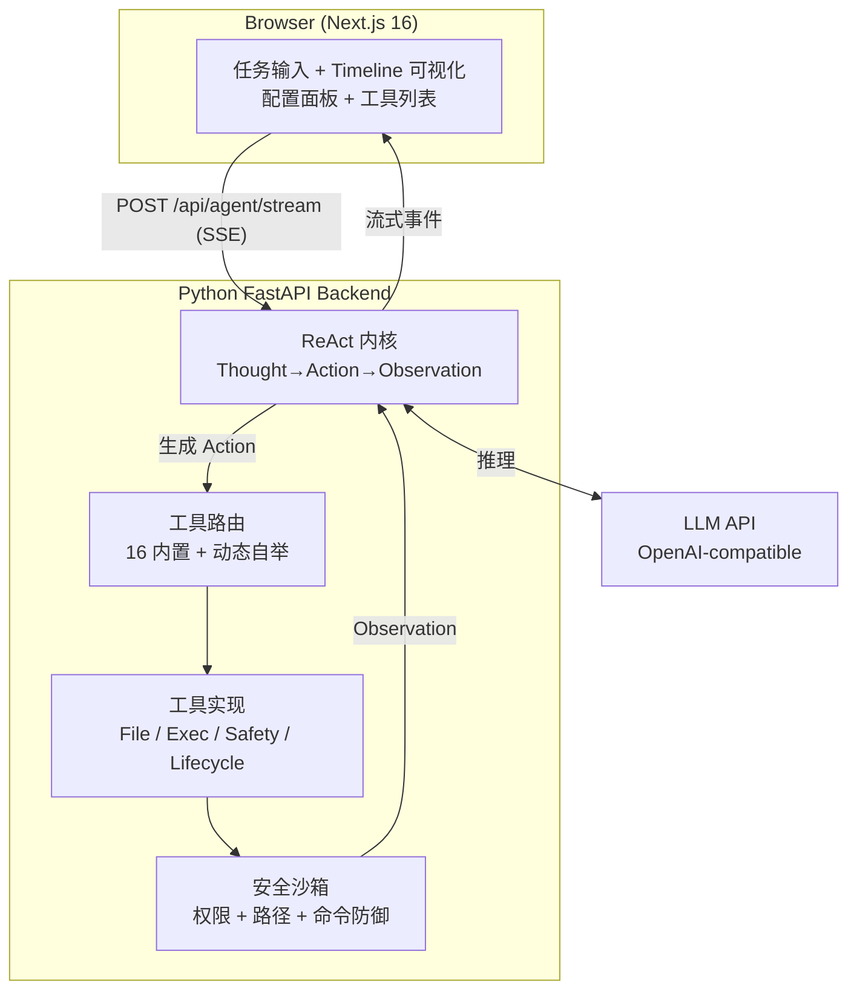

# EvolveLab

<p align="center">
  <strong>一个可视化、可定制的 AI Agent 实验平台</strong><br>
  看清 Agent 的每一步思考，给它装上你想要的任何工具
</p>

<p align="center">
  
  
  
  
  
</p>

<p align="center">
  <a href="#这是什么">这是什么</a> ·
  <a href="#和-cursorcodexclaude-code-有什么不同">差异化</a> ·
  <a href="#能做什么">能做什么</a> ·
  <a href="#快速开始">快速开始</a> ·
  <a href="#架构">架构</a> ·
  <a href="#安全设计">安全设计</a>
</p>

---

## 这是什么？

EvolveLab 是一个**白盒的 AI Agent 实验平台**。

大多数 AI 工具（Cursor、Trae、Copilot）是**黑盒**——你输入需求，它给结果，中间过程你看不到。EvolveLab 反过来：Agent 的每一次思考、每一次工具调用、每一个观察结果，都实时展示在 Timeline 上，让你**看清 AI 是怎么想的**。

同时，EvolveLab 是**可定制的**——Agent 不只能用内置工具，还能自己创建新工具并持久化保存。你也可以手动给它加工具，把它改造成你专属的 Agent。

> 适合谁用？
> - 想学习 AI Agent 原理的开发者
> - 想调试 / 研究 Agent 行为的人
> - 想搭建个人自动化工作流的极客
> - 对"AI 能怎么思考"感到好奇的人

## 和 Cursor/Codex/Claude Code 有什么不同？

| 维度 | Cursor / Codex / Claude Code | EvolveLab |
|------|------------------------------|-----------|
| **过程可见性** | 黑盒，只给结果 | 白盒，每步思考可见 |
| **工具系统** | 固定内置 | 可动态创建/删除，Agent 能自举新工具 |
| **定位** | 代码助手（需求驱动） | Agent 实验平台（探索驱动） |
| **内核** | 闭源 | 自研 ReAct 内核，完全开源 |
| **数据** | 部分经过云端 | 完全本地运行 |

**一句话**：它们帮你写代码，EvolveLab 帮你理解 Agent 是怎么工作的。

## 能做什么

### 示例 1：让 Agent 分析你的项目

```
任务：分析这个项目的结构，找出主要模块

Agent 执行轨迹：
  Step 1  THOUGHT  我需要先看根目录有哪些文件
          ACTION   list_files(path=".")
          OBSERVE  backend/  src/  package.json  README.md ...

  Step 2  THOUGHT  有 backend 和 src，先看 backend 结构
          ACTION   list_files(path="backend")
          OBSERVE  agent/  api/  auth/  tools/  main.py ...

  Step 3  THOUGHT  读 main.py 了解入口
          ACTION   read_file(path="backend/main.py")
          OBSERVE  FastAPI 应用，注册了路由...

  ✅ 结果：这是一个前后端分离的 Agent 实验平台，后端 FastAPI
          提供 ReAct 内核和工具系统，前端 Next.js 做 Timeline 可视化...
```

### 示例 2：让 Agent 给自己加一个新工具

```
任务：我需要一个能把文本翻译成英文的工具，你创建一下

Agent 执行轨迹：
  Step 1  THOUGHT  现有工具没有翻译能力，我用 create_tool 创建
          ACTION   create_tool(
                     name="translate_to_en",
                     description="将中文文本翻译为英文",
                     args=["text"],
                     code="def run(**kwargs): ..."
                   )
          OBSERVE  [成功] 工具 'translate_to_en' 已创建并注册

  Step 2  THOUGHT  测试一下新工具
          ACTION   translate_to_en(text="你好世界")
          OBSERVE  Hello World

  ✅ 结果：已创建翻译工具，持久化保存，重启后仍可用
```

### 示例 3：让 Agent 修改代码并安全验证

```
任务：在 backend/tools 下加一个计算器工具

Agent 执行轨迹：
  Step 1  THOUGHT  修改项目源码前必须先创建快照
          ACTION   create_snapshot()
          OBSERVE  [成功] 快照 ID: a1b2c3d4

  Step 2  THOUGHT  写入计算器工具代码
          ACTION   write_file(path="backend/tools/custom/calc.py", content="...")
          OBSERVE  文件已写入

  Step 3  THOUGHT  验证修改没有破坏项目
          ACTION   verify_build()
          OBSERVE  [成功] 构建验证通过

  ✅ 结果：计算器工具已添加，构建验证通过
```

## 核心特性

- **白盒 Timeline** — 实时渲染 Agent 的 Thought → Action → Observation 闭环，每一步都看得见
- **自研 ReAct 内核** — 不依赖 LangChain/AutoGen，从零实现推理循环，强制结构化 JSON 输出，死循环检测 + 上下文压缩
- **可定制工具系统** — 16 个内置工具 + Agent 运行时自举新工具，持久化到本地，重启后自动加载
- **自我修改安全层** — Git 快照 → 修改 → 构建验证 → 失败自动回滚，让 Agent 改自己的代码也不会崩
- **多层安全沙箱** — 命令注入三层防御、路径越界防护、角色权限分级、管理接口认证
- **完全本地运行** — 代码不离开你的电脑，API Key 存浏览器 localStorage，不碰文件系统

## 快速开始

### 1. 克隆仓库

```bash
git clone https://github.com/sorenjing/EvolveLab.git
cd EvolveLab
```

### 2. 启动后端

```bash
cd backend
python -m venv venv

# Windows
.\venv\Scripts\pip install -r requirements.txt
.\venv\Scripts\uvicorn main:app --host 127.0.0.1 --port 8001 --reload

# Linux / macOS
source venv/bin/activate
pip install -r requirements.txt
uvicorn main:app --host 127.0.0.1 --port 8001 --reload
```

### 3. 启动前端

```bash
# 回到项目根目录
npm install
npm run dev
```

浏览器访问 **http://localhost:3000**：

1. 点击右上角「设置」→ 填入 API Key → 测试连接 → 保存
2. 输入任务（如"分析这个项目的结构"）→ 点「执行」
3. 观察 Timeline 上 Agent 的实时思考过程

> **Windows 一键启动**：`.\start.ps1`

### 配置 API Key

API Key 在前端界面配置，保存在浏览器 localStorage，**不写入文件、不上传 GitHub**：

| 字段 | 说明 | 默认值 |
|------|------|--------|
| API Key | LLM API 密钥（必填） | — |
| Base URL | LLM API 地址 | `https://open.bigmodel.cn/api/paas/v4` |
| Model | 模型名称 | `glm-4-flash` |

<details>
<summary>支持的 LLM 提供商</summary>

| 提供商 | BASE_URL | 推荐 Model |
|--------|----------|-----------|
| 智谱 AI | `https://open.bigmodel.cn/api/paas/v4` | `glm-4-flash` |
| Moonshot | `https://api.moonshot.cn/v1` | `moonshot-v1-8k` |
| OpenAI | `https://api.openai.com/v1` | `gpt-4o-mini` |
| DeepSeek | `https://api.deepseek.com` | `deepseek-chat` |

</details>

## 架构



## 技术栈

| 层级 | 选型 | 说明 |
|------|------|------|
| 前端 | Next.js 16 + React 19 + TypeScript | App Router, Tailwind CSS v4 |
| 后端 | Python 3.10+ + FastAPI + Uvicorn | SSE 流式推送 |
| LLM | OpenAI-compatible API | 默认智谱 GLM-4-Flash，可换任意兼容模型 |
| 通信 | SSE (Server-Sent Events) | 端到端流式 |

## 安全设计

Agent 能执行命令和修改文件，因此安全是第一优先级：

### 命令注入防御（三层）

1. **黑名单正则** — 拦截 `rm -rf`、`format`、`del /f` 等危险命令
2. **元字符禁用** — 禁止 `;` `&` `|` `` ` `` `$` `>` `<` 等 shell 元字符
3. **精确白名单** — `shlex` 解析后精确匹配白名单（`npm install` 放行，`npm; rm -rf` 拦截）

### 其他安全机制

- **路径沙箱** — 文件操作限制在项目目录内
- **写前备份** — 修改前自动创建 `.bak` 备份
- **角色权限** — 只读 / 标准 / 管理员三级权限
- **管理接口认证** — `/api/admin/*` 默认仅 localhost，远程需 `ADMIN_TOKEN`
- **速率限制** — 全局 30/min，Agent 接口 10/min，防止额度滥用
- **默认 localhost** — 服务默认监听 `127.0.0.1`，不暴露公网

### 自我修改安全层

Agent 修改自身源码时的保护流程：

| 阶段 | 操作 | 工具 |
|------|------|------|
| 修改前 | 创建 Git 快照 | `create_snapshot` |
| 修改 | 写入/编辑文件 | `write_file` / `edit_file` |
| 验证 | 后端语法 + 前端类型检查 | `verify_build` |
| 回滚 | 验证失败时恢复 | `rollback` |

## 演进路线

### 已完成

- [x] **基础 ReAct Loop** — Thought→Action→Observation 推理循环 + 工具系统 + 前端 Timeline
- [x] **安全加固** — 命令注入三层防御、会话 TTL、JSON 解析容错、速率限制、管理接口认证
- [x] **自我修改安全层** — Git 快照 + 构建验证 + 失败自动回滚
- [x] **Agent 自主扩展工具** — `create_tool` 动态注册 + 本地持久化 + 重启自动加载
- [x] **工程化优化** — LLM 指数退避重试、AST 代码安全审查、Redis 会话持久化（内存降级）、结构化日志、命令输出截断、Agent 接口 Token 鉴权、前端组件拆分、安全逻辑单元测试

### 近期规划（高价值 / 中等工作量）

#### ReAct 内核升级
- [ ] **反思（Reflection）机制** — 任务失败/步骤卡顿时自动回溯分析失败原因，调整策略重试；支持用户手动触发反思让 Agent 总结进度与问题
- [ ] **智能死循环检测升级** — 从「重复 Action 检测」升级为「进度停滞检测」，识别连续多步无实质产出，自动打断并提供「换策略 / 人工介入 / 终止」三选项

#### 产品体验打磨
- [ ] **Timeline 可视化增强** — 连续同类操作自动折叠分组、按「思考/行动/结果」筛选、步骤详情面板（完整 Prompt / 原始输出 / Token 消耗 / 耗时）、成功/失败/警告状态视觉化
- [ ] **任务模板首页** — 5-8 个高频任务模板（分析项目结构 / 代码审查 / 生成 README / 创建翻译工具 / 检查项目安全）一键执行
- [ ] **轨迹导出** — 支持将 Agent 执行轨迹导出为 JSON / Markdown，方便写报告与分享

#### 稳定性增强
- [ ] **LLM 调用熔断降级** — 连续失败自动熔断并友好提示，避免前端无响应
- [ ] **Token 消耗统计** — 前端实时展示当前任务/会话的 Token 消耗与预估费用

### 中期规划（架构级 / 较大工作量）

#### 分层记忆系统
- [ ] **短期记忆** — 当前会话完整步骤链，保留原始上下文
- [ ] **长期记忆** — 轻量向量库（Chroma / FAISS）存储工具使用历史、项目分析结论、通用知识，下次同类任务自动检索复用

#### 多 Agent 协作模式
- [ ] **规划-执行-审核三 Agent 分工** — 规划 Agent 拆解任务生成计划、执行 Agent 调用工具完成单步、审核 Agent 验证结果不合格打回重执行
- [ ] **Timeline 分层展示** — 支持切换查看单 Agent 视角或全局视角

#### 工具系统生态扩展
- [ ] **工具模板库** — 内置常用工具包（代码审查 / 接口文档生成 / 数据统计 / 简易爬虫）一键启用
- [ ] **第三方 API 一键接入** — 输入 OpenAI 格式 API 地址和描述，自动生成对应工具并注册
- [ ] **工具运行时隔离** — 自定义工具改用 Docker 容器 / 独立虚拟环境执行，支持 Node.js、Shell 多语言工具

#### 工程化升级
- [ ] **后端分层架构** — 抽离 Service / Repository 层，内核、工具、沙箱各自解耦
- [ ] **单元测试覆盖** — pytest 覆盖 ReAct 内核、安全沙箱、核心工具，核心模块覆盖率 ≥ 70%
- [ ] **轻量数据库接入** — SQLite 存储会话历史、工具元数据、执行日志，替代文件持久化
- [ ] **前端状态管理** — Zustand 统一管理会话/配置/工具状态，消除 any 类型
- [ ] **E2E 测试** — Playwright 覆盖核心流程（启动→配置 Key→执行任务→Timeline 渲染）

#### 沙箱体系升级
- [ ] **容器级运行沙箱** — 命令执行与文件修改放入 Docker 容器，从「规则防御」升级为「物理隔离」
- [ ] **细粒度权限控制** — 从三级角色细化到单工具权限，可配置每个工具的可读目录与可执行命令范围
- [ ] **Prompt 注入防护** — 输入输出敏感词检测，拦截读取 `.env`、绕过安全、破坏性操作指令

### 远期规划（生态与交付）

#### 部署与交付
- [ ] **Docker 一键部署** — 前后端 Dockerfile + docker-compose.yml，一条命令启动全套服务
- [ ] **启动脚本补全** — Linux/macOS `start.sh` + 启动前环境检查
- [ ] **GitHub Actions CI/CD** — PR 自动跑单测/格式检查/构建验证，主分支合并自动生成 Release

#### 前端交互完善
- [ ] **多会话管理** — 标签页式多会话，数据持久化到本地，不同任务并行不干扰
- [ ] **独立工具管理页** — 启用/禁用、在线编辑源码、手动测试、导出导入
- [ ] **时间轴回溯重跑** — 点击历史步骤回退到该节点，修改指令后从中间重新执行
- [ ] **基础体验补全** — 暗黑模式、响应式适配、全局错误边界

#### 开源生态
- [ ] **文档体系完善** — CONTRIBUTING.md / CHANGELOG.md / FAQ.md，双语 README
- [ ] **架构文档细化** — DESIGN.md 补充 ReAct 时序图、SSE 流程图、沙箱原理图（Mermaid）
- [ ] **入门教程** — docs/ 目录写 2-3 篇教程（搭建项目分析 Agent / 自定义工具开发指南）
- [ ] **社区友好配置** — Issue / PR 模板，README 徽章与简介优化

> 路线图按价值与工作量分阶段推进，优先做「高价值 + 中等工作量」的项。欢迎在 Issue 中讨论优先级或认领任务。

## 贡献

欢迎 Issue 和 PR！提 PR 前请确保：

1. 后端代码通过 `python -m py_compile` 语法检查
2. 前端代码通过 `npm run build` 构建检查
3. 不要提交 `.env` 等含敏感信息的文件

## License

[MIT](LICENSE) © 2026 sorenjing
