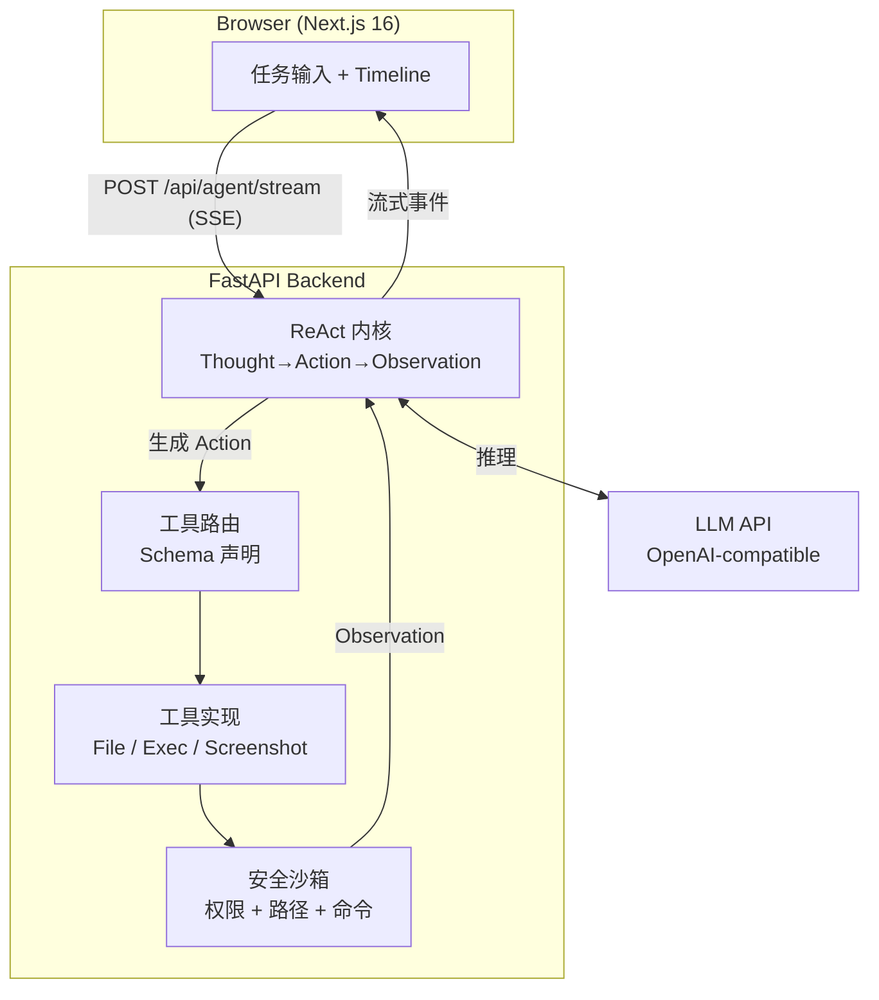

# Evolving AI

<p align="center">
  <strong>一个能读懂、修改并进化自身源码的 ReAct Agent</strong>
</p>

<p align="center">
  
  
  
  
  
</p>

<p align="center">
  <a href="#快速开始">快速开始</a> ·
  <a href="#架构">架构</a> ·
  <a href="#安全设计">安全设计</a> ·
  <a href="#演进路线">演进路线</a> ·
  <a href="#贡献">贡献</a>
</p>

---

## 这是什么？

Evolving AI 是一个**自进化 AI Agent**——它不仅能调用工具完成用户任务，还能像修改普通业务代码一样修改自己的工具集、Prompt 甚至内核。

与依赖 LangChain / AutoGen 的 Agent demo 不同，本项目**从零自研 ReAct 推理循环**，不绑定任何重型框架，内核完全可控。Agent 把自身源码视为另一组可读写文件，支持分级自进化：

- **L1**：自动新增工具并注册到路由
- **L2**：修改自身 System Prompt
- **L3**：修改 ReAct 内核逻辑
- **L4**：完整自举

> ⚠️ 这是一个前沿技术探索项目，自我修改能力涉及代码执行风险，请在沙箱环境中运行。

## Demo

<!-- 建议在此处放置一张 Timeline 运行截图或 GIF -->
<!--  -->

```
用户：列出当前项目根目录的文件，并总结项目结构

Step 1
┌─ THOUGHT ─────────────────────────────────────┐
│ 我需要先查看项目根目录有哪些文件               │
└───────────────────────────────────────────────┘
┌─ ACTION ──────────────────────────────────────┐
│ list_directory(path=".")                       │
└───────────────────────────────────────────────┘
┌─ OBSERVATION ──────────────────────────────────┐
│ backend/  src/  package.json  README.md  ...   │
└───────────────────────────────────────────────┘

Step 2
┌─ THOUGHT ─────────────────────────────────────┐
│ 项目包含 backend 和 src 目录，这是一个前后端   │
│ 分离的全栈项目...                              │
└───────────────────────────────────────────────┘

✅ 最终结果：这是一个自进化 Agent 项目，后端用 FastAPI...
```

## 核心特性

- **自研 ReAct 内核** — 不依赖 LangChain/AutoGen，自行实现 Thought → Action → Observation 循环，强制 LLM 输出结构化 JSON，支持死循环检测与最大步数限制
- **工具系统** — 文件读写/编辑、命令执行、目录搜索、屏幕截图等，工具通过 schema 声明并动态路由
- **自我修改机制** — Agent 的源码对它而言只是另一组可读写文件，支持 L1-L4 分级自进化
- **安全沙箱** — 路径越界防护、命令注入三层防御、写前自动备份、角色权限分级（详见[安全设计](#安全设计)）
- **上下文压缩** — 长任务自动压缩历史步骤，但严格保留 todo 与完成状态，防止 Agent "失忆"
- **SSE 实时轨迹** — 前端 Timeline 实时渲染每一步思考/动作/观察，端到端流式

## 架构



## 技术栈

| 层级 | 选型 | 说明 |
|------|------|------|
| 前端 | Next.js 16 + React 19 + TypeScript | App Router, Tailwind CSS v4 |
| 后端 | Python 3.10+ + FastAPI + Uvicorn | SSE 流式推送 |
| LLM | OpenAI-compatible API | 默认智谱 GLM-4-Flash，可换 Moonshot/OpenAI 等 |
| 通信 | SSE (Server-Sent Events) | 端到端流式 |

## 快速开始

### 1. 克隆仓库

```bash
git clone https://github.com/sorenjing/evolvingAI.git
cd evolvingAI
```

### 2. 配置 LLM

```bash
cd backend
cp .env.example .env
# 编辑 .env，填入你的 API Key
```

<details>
<summary>支持的 LLM 提供商（点击展开）</summary>

| 提供商 | BASE_URL | 推荐 Model |
|--------|----------|-----------|
| 智谱 AI | `https://open.bigmodel.cn/api/paas/v4` | `glm-4-flash` |
| Moonshot | `https://api.moonshot.cn/v1` | `moonshot-v1-8k` |
| OpenAI | `https://api.openai.com/v1` | `gpt-4o-mini` |
| DeepSeek | `https://api.deepseek.com` | `deepseek-chat` |

只需修改 `.env` 中的三个变量即可切换。
</details>

### 3. 启动后端

```bash
cd backend
python -m venv venv

# Windows
.\venv\Scripts\pip install -r requirements.txt
.\venv\Scripts\uvicorn main:app --host 0.0.0.0 --port 8001 --reload

# Linux / macOS
source venv/bin/activate
pip install -r requirements.txt
uvicorn main:app --host 0.0.0.0 --port 8001 --reload
```

### 4. 启动前端

```bash
# 回到项目根目录
npm install
npm run dev
```

浏览器访问 **http://localhost:3000**，输入任务即可看到 Agent 实时执行轨迹。

> **Windows 一键启动**：`.\start.ps1`

## 配置说明

### 后端 (`backend/.env`)

| 变量 | 说明 | 默认值 |
|------|------|--------|
| `LLM_API_KEY` | LLM API 密钥（必填） | — |
| `LLM_BASE_URL` | LLM API 地址 | `https://open.bigmodel.cn/api/paas/v4` |
| `LLM_MODEL` | 模型名称 | `glm-4-flash` |
| `MAX_STEPS` | Agent 最大推理步数 | `15` |

### 前端 (`.env.local`)

| 变量 | 说明 | 默认值 |
|------|------|--------|
| `NEXT_PUBLIC_BACKEND_URL` | 后端 API 地址 | `http://localhost:8001` |

## 项目结构

```
evolvingAI/
├── backend/
│   ├── agent/              # ReAct 内核
│   │   ├── kernel.py       # 推理循环主逻辑
│   │   ├── llm.py          # LLM 客户端封装
│   │   ├── prompts.py      # System Prompt
│   │   └── context.py      # 上下文压缩
│   ├── api/
│   │   └── routes.py       # FastAPI 路由（SSE 接口）
│   ├── auth/
│   │   ├── permissions.py  # 命令权限沙箱
│   │   └── capability.py   # LLM 能力探测
│   ├── tools/
│   │   ├── file_tools.py   # 文件读写/编辑
│   │   ├── system_tools.py # 命令执行/目录搜索
│   │   ├── screenshot.py   # 屏幕截图
│   │   └── cleanup.py      # 备份清理
│   ├── config.py
│   └── main.py
├── src/app/                # Next.js 前端
│   ├── page.tsx            # 任务输入 + Timeline
│   └── layout.tsx
├── DESIGN.md               # 详细设计方案
├── RUN.md                  # 运行与打包指南
└── start.ps1               # Windows 一键启动
```

## 安全设计

由于 Agent 能执行命令和修改文件，本项目设计了多层安全机制：

### 命令注入防御（三层）

1. **黑名单正则** — 拦截 `rm -rf`、`format`、`del /f` 等危险命令
2. **元字符禁用** — 禁止 `;` `&` `|` `` ` `` `$` `>` `<` 等 shell 元字符，阻断命令拼接
3. **精确白名单** — 用 `shlex` 解析命令名，精确匹配白名单（如 `npm install` 放行，`npm; rm -rf` 拦截）

### 路径沙箱

- 所有文件操作限制在 `PROJECT_ROOT` 内
- 越界访问自动拒绝

### 写前备份

- 文件修改前自动创建 `.bak` 备份
- 支持回滚

### 角色权限分级

| 角色 | 文件读 | 文件写 | 命令执行 |
|------|--------|--------|----------|
| 只读 | ✅ | ❌ | ❌ |
| 标准 | ✅ | ✅ | ✅（白名单内） |
| 管理员 | ✅ | ✅ | ✅（白名单内） |

## 演进路线

- [x] **Phase 1**：基础 ReAct Loop + 工具系统 + 前端 Timeline
- [x] **安全加固**：命令注入防御、会话 TTL、JSON 解析容错、单例修复
- [x] **Phase 2**：自我修改安全层（Git 快照 + 构建验证 + 回滚）
- [ ] **Phase 3**：L1 新增工具的端到端自举
- [ ] **Phase 4**：L2/L3 Prompt/内核修改

## 贡献

欢迎 Issue 和 PR！提 PR 前请确保：

1. 后端代码通过 `python -m py_compile` 语法检查
2. 前端代码通过 `npm run build` 构建检查
3. 不要提交 `.env` 等含敏感信息的文件

## License

[MIT](LICENSE) © 2026 sorenjing
